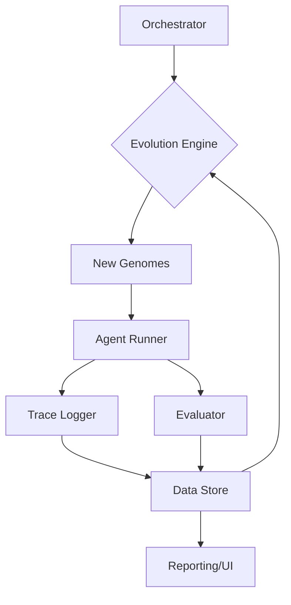

# EvoAgentBench: Implementation Guide for a Reproducible, Benchmark-Driven Evolutionary Optimization Platform for LLM Agents

**Author:** Manus AI
**Role:** Staff ML Systems Engineer
**Date:** January 23, 2026
**Version:** 1.0 (Initial Design)

---

## 1. Executive Summary

The **EvoAgentBench** platform is designed to bring **scientific rigor and evolutionary optimization** to the development of Large Language Model (LLM) agents. The core product goal is to provide a deterministic, reproducible, and auditable system for evaluating agent "genomes" (configurations of prompts, tools, memory, and planners) against a fixed, versioned benchmark suite. By computing a multi-metric fitness vector, the platform will drive an evolutionary loop to discover high-performing, robust, and safe agent configurations.

This implementation guide details the architecture for a **v1.0 system** with a primary focus on **Evaluation Rigor and Reproducibility**. This includes the design of the benchmark suite, the deterministic evaluation protocol, the LLM-as-Judge calibration, and the comprehensive tracing and artifact storage required for deterministic replay. The system is architected for Python orchestration and uses a lightweight, embedded database (DuckDB/SQLite) for fast, auditable data storage.

---

## 2. Non-Goals and Scope Boundaries

To ensure a focused and deliverable v1.0, the following items are explicitly **Non-Goals** for the initial release. They are included in the architecture as clear integration points for future versions (v1.5/v2.0).

| Category | Goal (v1.0) | Non-Goal (v1.0) | Future Integration Point (v1.5/v2.0) |
| :--- | :--- | :--- | :--- |
| **Agent** | Evaluation of pre-defined agent genomes. | Automatic generation of new agent architectures (e.g., new tool chains). | Advanced Evolution Operators (e.g., structured mutation of tool-use logic). |
| **Execution** | Controlled execution within a single, pinned environment. | Full, isolated execution of arbitrary code/tools in a secure sandbox. | Docker/Firecracker Sandbox Isolation. |
| **Optimization** | Single-objective or simple weighted-sum fitness. | True multi-objective optimization with complex Pareto front selection. | Multi-Objective Fitness and Pareto Selection. |
| **Deployment** | Local/CLI-driven orchestration and reporting. | Production-grade CLI, CI/CD integration, and artifact management. | Productionization (CLI/CI/Artifacts). |
| **Safety** | Basic task-level safety checks (e.g., no code execution in non-code tasks). | Comprehensive, adversarial safety suite gating and reporting. | Dedicated Safety Suite Gating. |
| **Observability** | Logging to file/DB and basic query-based reporting. | Real-time, interactive UI for lineage tracking and trace visualization. | Observability and Lineage UI. |

**Scope Boundaries:**
1. **LLM Dependency:** Assumes access to external LLM APIs (e.g., OpenAI, Anthropic). The system is responsible for managing API calls, versioning, and rate limits, but not the LLM inference itself.
2. **Tooling:** Assumes agent tools are pre-defined Python functions or external APIs. The system is responsible for mocking/replaying tool outputs, not for tool development.
3. **Orchestration:** The core orchestration logic will be implemented in Python, leveraging libraries for data processing (Pandas/Numpy) and statistical analysis.

---

## 3. System Architecture Overview

EvoAgentBench follows a modular, data-centric architecture designed for high auditability and deterministic execution. The system is composed of five primary components interacting with a central Data Storage Layer.

### 3.1. Components

1. **Orchestrator (`EvoBenchOrchestrator`):** The entry point. Manages the overall workflow, including loading the benchmark suite, initializing the first generation of genomes, and coordinating the evaluation and evolution cycles.
2. **Evolution Engine (`EvolutionEngine`):** Implements the core evolutionary loop (selection, mutation, crossover). It queries the Data Storage Layer for fitness scores and generates the next generation of genomes.
3. **Agent Runner (`AgentRunner`):** Executes a specific agent genome against a specific benchmark task. It manages the LLM API calls, tool execution, and adheres to strict budget/timeout constraints. **Crucially, it is responsible for logging every atomic step to the Trace Logger.**
4. **Evaluator (`Evaluator`):** Computes the fitness metrics for a completed agent run. This includes **Hard Metrics** (e.g., unit-style checks, regex matching) and coordinating the **Judge Evaluator**.
5. **Judge Evaluator (`JudgeEvaluator`):** A specialized component that uses an LLM (the "Judge") to score agent outputs based on a detailed rubric. It handles prompt templating, calibration, and bias mitigation.
6. **Data Storage Layer (`DataStore`):** The single source of truth, implemented using DuckDB/SQLite. Stores all persistent data: Genomes, Tasks, Runs, Metrics, and Traces.

### 3.2. Data Flow (High-Level)

The system operates in a continuous loop:



**Data Flow Sequence:**
1. **Initialization:** Orchestrator loads the versioned Benchmark Suite and initial Genomes into the Data Store.
2. **Selection:** Evolution Engine queries the Data Store for the fitness of the current population.
3. **Mutation/Crossover:** Evolution Engine generates a new set of Genomes.
4. **Execution:** Orchestrator schedules Agent Runner to execute each new Genome against all Tasks in the Benchmark Suite.
5. **Tracing:** Agent Runner logs all atomic events (LLM calls, tool calls, state changes) to the Data Store via the Trace Logger.
6. **Evaluation:** Agent Runner passes the final output and trace ID to the Evaluator. The Evaluator computes Hard Metrics and invokes the Judge Evaluator for Soft Metrics.
7. **Storage:** Evaluator writes the final Run record and all computed Metrics to the Data Store.
8. **Loop:** Evolution Engine repeats the cycle.

### 3.3. ASCII Architecture Diagram

```
+----------------------------------------------------------------+
| EvoAgentBench Orchestrator                                     |
+----------------------------------------------------------------+
        |
        v
+----------------------------------------------------------------+
| Evolution Engine (Selection, Mutation, Crossover)              |
+----------------------------------------------------------------+
        | Schedules Runs
        v
+----------------------------------------------------------------+
| Agent Runner (Execution Environment)                           |
|  +----------------+  +-----------------+  +------------------+ |
|  | LLM API Client |  | Tool Executor   |  | Trace Logger     | |
|  +----------------+  +-----------------+  +------------------+ |
+----------------------------------------------------------------+
        |
        v
+----------------------------------------------------------------+
| Evaluator                                                      |
|  +----------------+  +-----------------+  +------------------+ |
|  | Hard Metrics   |  | Judge Evaluator |  | Scoring Agg.     | |
|  +----------------+  +-----------------+  +------------------+ |
+----------------------------------------------------------------+
        | Writes Run/Metrics
        v
+----------------------------------------------------------------+
| Data Storage Layer (DuckDB/SQLite)                             |
| (Genomes, Tasks, Runs, Metrics, Traces, Ablations)             |
+----------------------------------------------------------------+
        ^
        | Reads Fitness
        +--------------------------------------------------------+
```

## 4. Benchmark Suite Specification (GO VERY DEEP)

The benchmark suite is the foundation of EvoAgentBench's rigor. It must be designed to be static, versioned, and comprehensive, preventing the "moving target" problem common in agent evaluation.

### 4.1. Task Taxonomy

We define a taxonomy to ensure broad coverage of agent capabilities. Each task in the suite must be tagged with one or more of these categories.

| Category | Description | Primary Challenge | Example Task |
| :--- | :--- | :--- | :--- |
| **Tool-Use** | Requires the agent to correctly identify, call, and interpret the results of external functions/APIs. | Function signature parsing, complex multi-step tool chains. | *Financial Data Analysis:* Use `stock_price_lookup` and `calculate_moving_average` tools. |
| **Retrieval/Citation** | Requires the agent to accurately retrieve information from a knowledge base and cite the source correctly. | Hallucination, source attribution, context window management. | *Policy Q&A:* Answer a question based on a provided document set, citing the exact paragraph. |
| **Code Tasks** | Requires the agent to write, debug, or execute code to solve a problem. | Syntax correctness, logical flow, handling execution errors. | *Algorithm Implementation:* Write a Python function to solve a LeetCode-style problem. |
| **Planning Tasks** | Requires multi-step reasoning, state tracking, and error correction over a sequence of actions. | State management, long-term dependency tracking, self-correction. | *Virtual Home Assistant:* Plan a sequence of actions (e.g., open fridge, find item, close fridge). |
| **Adversarial/Injection** | Tasks designed to test the agent's robustness against prompt injection, data poisoning, or jailbreaking attempts. | Security, adherence to system instructions, refusal policy. | *Conflicting Instructions:* A prompt that contains a malicious instruction hidden within a benign one. |

### 4.2. Task Format and Schema

All tasks are defined using a strict, versioned JSON schema. This ensures the Orchestrator can reliably load and execute the task, and the Evaluator can find the necessary "gold" answers and grading logic.

**Schema: `TaskSpec` (YAML/JSON)**

```yaml
# /schemas/task_spec_v1.yaml
task_id: string # Unique, immutable ID (e.g., "tool_use_finance_001")
version: integer # Increments on any change to prompt, gold, or checker
category: list[string] # Must include at least one from the taxonomy
difficulty: enum[easy, medium, hard]
prompt_template: string # The base prompt to be given to the agent
context: string # Optional: any initial context (e.g., a document for RAG)
input_params: dict # Optional: parameters to be injected into the prompt_template
gold_answer: dict # The ground truth data for evaluation
  # Structure depends on the checker_type
  # Example: {"final_answer": "123.45", "tool_calls": ["lookup(AAPL)", "calc_avg(30)"]}
checker_type: enum[regex, json_schema, python_unit, llm_judge_only]
checker_config: dict # Configuration for the checker
  # Example for regex: {"pattern": "The final answer is (\\d+\\.\\d+)", "group": 1}
  # Example for python_unit: {"module": "checkers.finance", "function": "check_finance_task"}
budget: dict # Execution limits for the AgentRunner
  max_tokens: integer
  max_tool_calls: integer
  max_time_seconds: integer
```

**Concrete Example 1: Tool-Use Task (YAML)**

```yaml
task_id: tool_use_weather_003
version: 2
category: [tool-use, planning]
difficulty: medium
prompt_template: "What is the weather like in {city} and what is the current time there? Use the provided tools."
context: ""
input_params:
  city: "London, UK"
gold_answer:
  final_answer_regex: "The weather in London is (\\w+) and the time is (\\d{2}:\\d{2})"
  required_tool_calls: ["get_weather(London, UK)", "get_current_time(London, UK)"]
checker_type: regex
checker_config:
  pattern: "The weather in London is (\\w+) and the time is (\\d{2}:\\d{2})"
  group: 0 # Match the entire string for a pass/fail
budget:
  max_tokens: 1024
  max_tool_calls: 5
  max_time_seconds: 30
```

**Concrete Example 2: Retrieval/Citation Task (JSON)**

```json
{
  "task_id": "retrieval_policy_012",
  "version": 1,
  "category": ["retrieval/citation"],
  "difficulty": "hard",
  "prompt_template": "According to the provided document, what is the policy regarding remote work for new hires?",
  "context": "The full text of the company's HR policy document (version 3.1) is provided as a tool-accessible knowledge base.",
  "input_params": {},
  "gold_answer": {
    "expected_text_snippet": "New hires are eligible for remote work after a 90-day probationary period.",
    "expected_source_id": "HR_Policy_v3.1",
    "expected_source_span": [450, 520]
  },
  "checker_type": "python_unit",
  "checker_config": {
    "module": "checkers.citation",
    "function": "check_citation_accuracy"
  },
  "budget": {
    "max_tokens": 2048,
    "max_tool_calls": 10,
    "max_time_seconds": 60
  }
}
```

### 4.3. Input/Output Contracts for Agent Runs

The contract defines the expected input to the `AgentRunner` and the structured output it must produce for the `Evaluator`.

| Contract | Component | Description | Schema Field |
| :--- | :--- | :--- | :--- |
| **Input** | `AgentRunner` | The full, instantiated task specification, the agent's genome (config), and a unique run seed. | `TaskSpec`, `GenomeSpec`, `run_seed` |
| **Output** | `AgentRunner` | The final output of the agent's reasoning process, plus the full trace ID. | `final_response: string`, `trace_id: string` |

### 4.4. Gold Answers and Checkers

**Gold Answers** are the ground truth. They must be created by human experts and cross-validated.

**Checkers** are the grading functions. We prioritize **unit-style graders** for maximum determinism.

1.  **`regex`:** Simple pass/fail based on a pattern match in the final response. Fast and deterministic.
2.  **`json_schema`:** Ensures the agent's output conforms to a required JSON structure (e.g., for a structured data extraction task).
3.  **`python_unit`:** A custom Python function that takes the agent's final output, the full trace, and the `gold_answer` as input, returning a structured metric dictionary. This is used for complex logic like citation verification.
4.  **`llm_judge_only`:** Used when the task is inherently subjective (e.g., creative writing, tone analysis). The hard metric is simply a placeholder, and the score relies entirely on the Judge Evaluator.

### 4.5. Dataset Versioning Strategy and Governance

The entire benchmark suite is treated as a single, versioned artifact.

1.  **Git-Based Versioning:** The `TaskSpec` files are stored in a dedicated Git repository (`/benchmarks/vX.Y.Z`). Any change to a `TaskSpec` file (even a single character in the prompt) **MUST** trigger a version bump in the `version` field within the file and a new Git tag for the entire suite.
2.  **Immutability:** Once a benchmark version is used for an evolutionary run, that version is **immutable**. All run manifests (Section 6) must record the exact Git commit hash and the specific `task_id` and `version` of every task used.
3.  **Governance:** A formal review process (e.g., a Pull Request with two approvals) is required to merge any changes to the benchmark suite. This prevents "benchmark hacking" where agents are evolved against a suite that is subtly modified to favor them.

---

## 5. Evaluation Protocol (GO VERY DEEP)

The evaluation protocol is the core of EvoAgentBench's rigor, ensuring that fitness scores are reliable, comparable, and statistically sound.

### 5.1. Run Orchestration

**Seeding and Determinism:**
Every run must be fully deterministic. The `AgentRunner` must accept a single, master `run_seed` (a large integer) from the Orchestrator. This seed is used to:
1.  Seed the LLM API call (if the provider supports it, e.g., OpenAI's `seed` parameter).
2.  Seed all internal random number generators (Python's `random`, NumPy, etc.).
3.  Seed the tool execution environment (if any tool uses randomness).

**Environment Pinning:**
The entire execution environment (Python version, dependency versions, LLM model versions) must be captured in the `RunManifest` (Section 6). The Orchestrator must enforce that all runs within a single generation use the **exact same pinned environment**.

### 5.2. Controlled Execution

**Budgets:**
The `AgentRunner` strictly enforces the `budget` defined in the `TaskSpec`.
*   **Token Budget:** Monitored via the LLM API client wrapper. Exceeding the budget results in a **BudgetExceeded** failure status.
*   **Tool Call Budget:** Monitored by the tool execution wrapper. Exceeding results in a **BudgetExceeded** failure status.
*   **Time Budget:** Monitored by a thread-level timer/timeout mechanism. Exceeding results in a **Timeout** failure status.

**Failure Handling and Retries:**
*   **Deterministic Failures:** Failures caused by the agent's logic (e.g., malformed tool input, exceeding budget) are **not retried**. The run is marked as failed, and the trace is stored.
*   **Stochastic Failures:** Failures caused by external services (e.g., LLM API rate limit, network error) are retried up to 3 times with exponential backoff. If all retries fail, the run is marked as **ExternalFailure**.

### 5.3. Metrics: Hard Metrics vs. Soft Metrics

The evaluation produces a vector of metrics, categorized by their source.

| Metric Type | Source | Example Metrics | Determinism |
| :--- | :--- | :--- | :--- |
| **Hard Metrics** | Unit-style checkers (Regex, Python) | `pass_fail` (boolean), `tool_correctness` (0-1), `citation_count` (int), `latency_seconds` (float) | High (100%) |
| **Soft Metrics** | LLM-as-Judge | `coherence_score` (1-5), `completeness_score` (1-5), `adherence_to_persona` (1-5) | Medium (Requires calibration) |

### 5.4. Judge Design

The LLM-as-Judge component is critical for evaluating subjective quality and complex reasoning.

**Rubric and Prompt Templates:**
1.  **Structured Rubric:** The Judge is provided with a clear, structured rubric (e.g., a 5-point Likert scale for 3-5 dimensions).
2.  **Few-Shot Examples:** The Judge prompt includes 3-5 high-quality, diverse few-shot examples of agent outputs, their corresponding scores, and the justification for those scores.
3.  **Output Format:** The Judge is forced to output a structured JSON object containing the scores and a mandatory justification field.

**Bias Mitigation and Calibration:**
1.  **Order Bias:** The order of agent outputs (when comparing two agents) is randomized to mitigate positional bias.
2.  **Calibration:** A **Calibration Suite** (a small, fixed set of tasks with known, expert-scored outputs) is run periodically. If the Judge's scores deviate significantly from the expert scores (e.g., >1 standard deviation), the Judge's prompt (e.g., few-shot examples, system instructions) must be updated and the new version recorded.

**Inter-Judge Agreement:**
For high-stakes evaluations (e.g., final generation selection), a subset of runs is scored by **two different Judge models** (e.g., GPT-4 and Claude 3 Opus). The **Cohen's Kappa** statistic is calculated to monitor inter-rater reliability. Low Kappa triggers a review of the Judge rubric.

### 5.5. Citation Verification: A Design for Hallucination Detection

To detect hallucinated citations or mismatched sources in Retrieval tasks, we implement a **Trace-Based Citation Verification** method.

**Method:**
1.  **Trace Capture:** The `AgentRunner`'s RAG tool wrapper must log the exact text snippets retrieved from the knowledge base for each tool call, along with the source ID and span.
2.  **Post-Hoc Verification:** The `Evaluator` (specifically, a `python_unit` checker) performs two checks:
    *   **Source Existence Check:** For every citation in the agent's final response (e.g., `[1]`), verify that the source ID (`[1]`) corresponds to a document actually retrieved and logged in the trace.
    *   **Text Span Check:** For every claim in the agent's final response that is attributed to a source, perform a **Maximum Common Subsequence (MCS)** or **fuzzy string matching** (e.g., using `difflib` or `rapidfuzz`) between the claimed text and the retrieved text snippets in the trace.
3.  **Metric:** A `citation_fidelity` metric (0-1) is computed: `(Correct Citations + Correct Claims) / (Total Citations + Total Claims)`. A claim is marked as a **Hallucination** if it is attributed to a source but has low fidelity (<80% MCS) to the retrieved text.

### 5.6. Scoring Aggregation

**Weighted Scoring (Single-Objective):**
For initial evolution, a single scalar fitness score is required. This is a weighted sum of the metric vector.

$$
\text{Fitness} = \sum_{i=1}^{N} w_i \cdot \text{Metric}_i
$$

| Metric | Weight ($w_i$) | Justification |
| :--- | :--- | :--- |
| `pass_fail` (Hard) | 0.5 | Core task completion is the most important factor. |
| `citation_fidelity` (Hard) | 0.3 | Essential for trustworthy agents, second highest priority. |
| `coherence_score` (Soft) | 0.1 | Subjective quality is a secondary factor. |
| `latency_seconds` (Hard) | -0.1 | A negative weight to penalize slow agents. |

The weights ($w_i$) are defined in the `EvolutionEngine` configuration and are versioned.

**Multi-Objective Vector (v2 Hook):**
For v2, the fitness will be a vector $\vec{F} = (\text{Metric}_1, \text{Metric}_2, \dots, \text{Metric}_N)$. The primary objectives will be:
1.  **Performance:** Maximize `pass_fail` and `citation_fidelity`.
2.  **Efficiency:** Minimize `latency_seconds` and `token_count`.
3.  **Safety:** Maximize `safety_score` (from v2 safety suite).

Selection will then use **Pareto dominance** to identify the non-dominated set of agents (the Pareto front).

### 5.7. Statistical Reporting

Evaluation results must be reported with statistical rigor to allow for valid comparisons.

1.  **Confidence Intervals (CI):** All aggregate metrics (e.g., mean `pass_fail` rate) must be reported with 95% **Bootstrap Confidence Intervals**. This is preferred over standard error for non-normal distributions common in pass/fail metrics.
2.  **Significance Testing:** When comparing two genomes (e.g., a parent vs. a mutated child, or an evolved agent vs. a baseline), a **Permutation Test** or **Bootstrap Hypothesis Test** will be used to determine if the difference in performance is statistically significant ($p < 0.05$).
3.  **Win/Tie/Loss:** For a pair-wise comparison, the system reports the percentage of tasks where Agent A significantly outperformed Agent B, where Agent B significantly outperformed Agent A, and where the difference was a statistical tie.

### 5.8. Ablation Framework

The ablation framework allows engineers to systematically test the impact of a single genome parameter.

**Definition:** An ablation run is a set of runs where one factor (e.g., `retrieval_top_k`, `planner_type`) is varied across a defined range, while all other genome parameters are held constant.

**Implementation:**
1.  **Ablation Config:** A configuration file defines the `base_genome_id`, the `factor_key` (e.g., `retrieval_config.top_k`), and the `factor_values` (e.g., `[1, 3, 5, 10]`).
2.  **Orchestration:** The Orchestrator generates a temporary set of genomes by cloning the base genome and injecting each factor value.
3.  **Comparison:** The results are stored in a dedicated `ablations` table. The statistical reporting module is used to perform pair-wise significance tests between the factor values (e.g., is `top_k=5` significantly better than `top_k=3`?).

### 5.9. Baseline Agents

To provide context for the evolutionary process, at least three baseline agents must be defined and evaluated against every version of the benchmark suite.

1.  **Zero-Shot Baseline:** The simplest agent: a single prompt with no tools, no memory, and no explicit planning. Serves as the lower bound for performance.
2.  **ReAct Baseline:** A standard, well-documented agent architecture (e.g., ReAct or CoT) with a fixed, non-evolved prompt. Serves as the industry-standard comparison.
3.  **Previous Best Baseline:** The best-performing agent from the previous generation or the last successful evolutionary run. Serves as the direct competitor for the current generation.

## 6. Reproducibility and Deterministic Replay (GO VERY DEEP)

Reproducibility is the cornerstone of EvoAgentBench. It ensures that any run can be exactly recreated, which is essential for debugging, auditing, and scientific validation.

### 6.1. Run Manifest: What Must Be Captured

The `RunManifest` is a comprehensive, immutable record of all inputs required to deterministically execute a run. It is generated *before* the run starts and stored in the Data Storage Layer.

**Run Manifest Schema (JSON Example)**

```json
{
  "run_id": "uuid-v4-unique-identifier",
  "task_id": "tool_use_weather_003",
  "task_version": 2,
  "genome_id": "g_prompt_v1_temp_0.7",
  "generation_id": 42,
  "run_seed": 1678886400,
  "start_timestamp": "2026-01-23T10:00:00Z",
  "environment": {
    "os": "Ubuntu 22.04",
    "python_version": "3.11.0",
    "dependency_hashes": {
      "openai": "sha256:...",
      "pydantic": "sha256:..."
    },
    "tool_versions": {
      "get_weather": "v1.2.1",
      "get_current_time": "v1.0.0"
    }
  },
  "llm_config": {
    "model_name": "gpt-4.1-mini",
    "model_version": "2026-01-20",
    "temperature": 0.7,
    "top_p": 1.0,
    "seed": 1678886400,
    "system_fingerprint": "fp_1234567890"
  },
  "prompt_hashes": {
    "system_prompt": "sha256:...",
    "user_prompt": "sha256:..."
  },
  "benchmark_suite_commit": "git_commit_hash_of_benchmark_repo"
}
```

### 6.2. Trace Storage: Structured Event Schema

The `AgentRunner` must log every atomic step of the agent's execution as a structured event. This trace is the key to understanding the agent's reasoning and enabling deterministic replay.

**Trace Event Schema (Stored in `traces` table)**

| Field | Type | Description |
| :--- | :--- | :--- |
| `trace_id` | UUID | Foreign key to the `runs` table. |
| `step_index` | Integer | Sequential index of the event within the run. |
| `timestamp` | Float | Time elapsed since run start (for performance analysis). |
| `event_type` | Enum | `MODEL_INPUT`, `MODEL_OUTPUT`, `TOOL_CALL`, `TOOL_RESULT`, `FINAL_ANSWER`. |
| `payload` | JSONB | Event-specific data. |
| `input_hash` | String | SHA256 hash of the input content (e.g., the prompt). |
| `output_hash` | String | SHA256 hash of the output content (e.g., the LLM response). |

**Example Payloads:**

*   **`MODEL_INPUT`:** `{"prompt": "The full text of the prompt sent to the LLM."}`
*   **`MODEL_OUTPUT`:** `{"response": "The raw text response from the LLM.", "token_usage": {"input": 100, "output": 50}}`
*   **`TOOL_CALL`:** `{"tool_name": "get_weather", "arguments": {"city": "London, UK"}}`
*   **`TOOL_RESULT`:** `{"result": "The weather is sunny and 15C."}`

### 6.3. Replay Mode: Mocking External Services

Deterministic replay is achieved by intercepting and mocking all non-deterministic external calls.

1.  **Replay Orchestration:** A dedicated `ReplayRunner` component is used. It takes a `run_id` as input.
2.  **Mocking Layer:** The `ReplayRunner` initializes a mocking layer that wraps the LLM API client and the Tool Executor.
3.  **Execution:** When the agent's code attempts an external call (LLM or Tool), the mocking layer:
    *   **Checks the Trace:** It looks up the next expected `MODEL_INPUT` or `TOOL_CALL` event in the stored trace.
    *   **Verifies Input:** It computes the `input_hash` of the current call and compares it to the `input_hash` in the trace. **If the hashes do not match, the replay fails immediately**, indicating a non-deterministic deviation.
    *   **Returns Mocked Output:** If the input hash matches, it returns the `payload` from the corresponding `MODEL_OUTPUT` or `TOOL_RESULT` event in the trace, effectively **replaying the exact output** without calling the external service.

This process ensures that the agent's internal logic and the external environment's responses are exactly the same as the original run.

### 6.4. Artifact Bundles

Artifact bundles are compressed archives that contain all necessary files for offline audit and sharing.

**Contents:**
1.  `run_manifest.json`
2.  `trace.jsonl` (JSON Lines of all trace events)
3.  `task_spec.json` (The specific task definition used)
4.  `genome_spec.json` (The specific genome definition used)
5.  `metrics_report.json` (Final computed metrics and scores)
6.  `logs/` (Raw logs from the execution environment)

**Naming Convention:** `artifact_bundle_{run_id}_{genome_id}_{task_id}.zip`

---

## 7. Data Storage Layer (DEEP)

The Data Storage Layer is the central repository for all experimental data. We choose **DuckDB** (or SQLite for simpler deployments) for its embedded nature, transactional integrity, and strong support for analytical queries (OLAP).

### 7.1. DuckDB/SQLite Schema

The schema is designed to support fast lookups for evolutionary selection, complex analytical queries for reporting, and efficient storage of large trace data.

**Minimum Required Tables (6+):**

| Table Name | Primary Key | Description | Key Fields | Indexing Strategy |
| :--- | :--- | :--- | :--- | :--- |
| **`genomes`** | `genome_id` (UUID) | Agent configurations (prompts, tool configs, hyperparams). | `parent_id`, `generation`, `config_hash` | `generation`, `config_hash` |
| **`tasks`** | `task_id`, `version` | Immutable benchmark task definitions. | `category`, `difficulty`, `checker_type` | `category`, `difficulty` |
| **`runs`** | `run_id` (UUID) | Metadata for a single execution of a genome on a task. | `genome_id`, `task_id`, `run_seed`, `status` | `genome_id`, `task_id`, `status` |
| **`metrics`** | `run_id`, `metric_name` | Key-value store for all computed metrics (hard and soft). | `metric_value`, `is_hard_metric` | `metric_name`, `metric_value` |
| **`traces`** | `trace_id`, `step_index` | Detailed, ordered log of all agent actions and external calls. | `event_type`, `input_hash`, `output_hash` | `trace_id`, `event_type` |
| **`ablations`** | `ablation_id` (UUID) | Configuration and results for ablation experiments. | `base_genome_id`, `factor_key`, `factor_value` | `base_genome_id`, `factor_key` |
| **`generations`** | `generation_id` (Int) | Summary statistics for each evolutionary generation. | `start_time`, `best_genome_id`, `avg_fitness` | `generation_id` |

### 7.2. Indexing Strategy and Queries for Dashboards

The indexing strategy prioritizes the most common and critical queries for the evolutionary loop and reporting.

**Critical Queries:**

1.  **Evolutionary Selection:** Find the fitness of all genomes in the current generation.
    ```sql
    SELECT g.genome_id, AVG(m.metric_value) AS fitness
    FROM genomes g
    JOIN runs r ON g.genome_id = r.genome_id
    JOIN metrics m ON r.run_id = m.run_id
    WHERE g.generation = :current_gen AND m.metric_name = 'weighted_fitness'
    GROUP BY g.genome_id;
    ```
    *   **Indexing Focus:** `genomes.generation`, `runs.genome_id`, `metrics.metric_name`.

2.  **Dashboard Reporting (Task Performance):** Find the pass rate for a specific genome across all tasks.
    ```sql
    SELECT t.category, AVG(CASE WHEN m.metric_value = 1 THEN 1.0 ELSE 0.0 END) AS pass_rate
    FROM runs r
    JOIN metrics m ON r.run_id = m.run_id
    JOIN tasks t ON r.task_id = t.task_id AND r.task_version = t.version
    WHERE r.genome_id = :target_genome_id AND m.metric_name = 'pass_fail'
    GROUP BY t.category;
    ```
    *   **Indexing Focus:** `runs.genome_id`, `metrics.metric_name`, `tasks.category`.

3.  **Debugging/Audit (Trace Retrieval):** Retrieve the full trace for a failed run.
    ```sql
    SELECT payload, event_type, step_index
    FROM traces
    WHERE trace_id = (SELECT trace_id FROM runs WHERE run_id = :failed_run_id)
    ORDER BY step_index ASC;
    ```
    *   **Indexing Focus:** `traces.trace_id`.

The use of a columnar-oriented database like DuckDB is ideal for these analytical, aggregate queries, which are far more common than simple row-by-row lookups in this system.

## 8. Evolution Loop (MEDIUM DEPTH)

The Evolution Engine drives the optimization process, using the fitness scores from the Evaluation Protocol to select and generate the next generation of agent genomes.

### 8.1. Evaluation Plugs into Selection/Mutation

The `EvolutionEngine` operates on the `genomes` and `metrics` tables in the Data Store.

1.  **Selection:** The engine queries the Data Store to retrieve the aggregated `weighted_fitness` score for every genome in the current generation.
2.  **Parent Selection:** A **Tournament Selection** strategy is chosen for its robustness and simplicity.
    *   Randomly select $k$ genomes (e.g., $k=5$).
    *   The genome with the highest `weighted_fitness` in the tournament is selected as a parent.
    *   Repeat to select the required number of parents for the next generation.
3.  **Mutation:** The selected parent genomes are passed to the `GenomeMutator`.
    *   **Mutation Operators:** Simple operators include: random change of a hyperparameter (e.g., `temperature`), random addition/removal of a tool, or a small LLM-driven rewrite of a section of the system prompt.
    *   **New Genome Creation:** The mutated genome is assigned a new `genome_id`, its `parent_id` is set, and it is inserted into the `genomes` table with `generation = current_generation + 1`.

### 8.2. Selection Strategy: Tournament vs Elitist vs Novelty

We will start with **Tournament Selection** as the default, as described above.

*   **Elitist Strategy:** A simple form of elitism will be implemented by automatically carrying over the top 5% of genomes (based on fitness) from the current generation to the next, without mutation. This prevents the loss of high-performing configurations.
*   **Novelty Search (v2 Hook):** Novelty search is a non-goal for v1.0 but is a key v2 extension. It would require a **Behavioral Descriptor** (e.g., a vector representing the sequence of tool calls) to be stored in the `metrics` table. Selection would then favor genomes that exhibit novel behavior, regardless of immediate fitness.

### 8.3. Preventing Overfitting and "Benchmark Hacking"

Overfitting to the fixed benchmark suite is a critical risk. We must implement structural safeguards.

1.  **Holdout Suite:** A portion of the benchmark tasks (e.g., 10%) must be designated as the **Holdout Suite**. These tasks are **never** used to calculate the `weighted_fitness` score for the evolutionary loop. They are only used for final reporting and comparison against baselines. If a genome performs well on the main suite but poorly on the holdout, it indicates overfitting.
2.  **Fitness Function Complexity:** The multi-metric fitness vector (Section 5.6) is designed to prevent simple optimization. By including metrics like `citation_fidelity` and a penalty for `latency`, the agent must optimize for a complex, robust definition of "goodness," not just a single pass/fail metric.
3.  **Benchmark Governance:** The strict versioning and immutability policy (Section 4.5) prevents engineers from "hacking" the benchmark by subtly changing tasks to favor their current best agent.

---

## 9. Hooks for v2 Features (LIGHT BUT CLEAR)

The v1.0 architecture must include clear integration points (interfaces, events, tables) to facilitate the seamless addition of v2 features without major refactoring.

| v2 Feature | Integration Point (v1.0 Implementation) | Interface/Table Change |
| :--- | :--- | :--- |
| **Typed Genome Schema Validation (2)** | **`GenomeValidator` Module:** A placeholder module that currently only validates basic JSON structure. | **`genomes` table:** Add a `schema_version` column. The `GenomeValidator` will load the schema based on this version. |
| **Pareto Selection (3)** | **`metrics` table:** Ensure all relevant metrics (Performance, Efficiency, Safety) are stored as separate columns/rows, not just the aggregated `weighted_fitness`. | **`EvolutionEngine`:** The selection logic is encapsulated in a `SelectionStrategy` interface. V1.0 implements `TournamentSelection`; V2.0 will implement `ParetoSelection`. |
| **Docker Sandboxing (4)** | **`AgentRunner` Interface:** The `AgentRunner` is an abstract interface. V1.0 implements `LocalPythonRunner`. | **`AgentRunner`:** V2.0 will implement `DockerContainerRunner`, which takes the same `run_manifest` but executes the agent within a secure container. |
| **Tracing + Lineage UI (5)** | **`traces` table:** The detailed, structured trace data is already being captured (Section 6.2). | **New Service:** A new `LineageService` will be built on top of the existing `traces` table, providing GraphQL/REST endpoints for a UI to query and visualize the event stream. |
| **Advanced Operators (6)** | **`GenomeMutator` Interface:** The mutation logic is encapsulated. V1.0 implements simple operators. | **`GenomeMutator`:** V2.0 will implement `LLMMutator` which uses an LLM to propose and validate complex, semantic changes to the prompt/config. |
| **Safety Suite Gating (7)** | **`Evaluator` Interface:** The `Evaluator` has a `pre_run_check` method that currently only checks budgets. | **`Evaluator`:** V2.0 will integrate a `SafetySuite` module into `pre_run_check`. If the agent's prompt/config triggers a safety violation, the run is immediately marked as `SafetyFailure` and is not executed. |
| **CLI/CI Packaging (8)** | **`Orchestrator` Interface:** The Orchestrator is currently a Python class. | **New Artifact:** The `Orchestrator` will be wrapped in a `pyinstaller` or similar tool to create a standalone CLI executable. The `RunManifest` will be extended to include CI/CD metadata. |

---

## 10. Reference Implementation Plan

### 10.1. Repository Structure

The project will be structured to clearly separate the core engine, the benchmark data, and the execution environment.

```
/EvoAgentBench
├── README.md
├── requirements.txt
├── evoagentbench/
│   ├── __init__.py
│   ├── core/
│   │   ├── orchestrator.py      # Main entry point, manages generations
│   │   ├── evolution_engine.py  # Selection, mutation logic
│   │   ├── genome_mutator.py    # Mutation operators
│   │   └── data_store.py        # Data access layer (DuckDB/SQLite)
│   ├── runner/
│   │   ├── agent_runner.py      # Executes agent, logs trace
│   │   ├── replay_runner.py     # Deterministic replay logic
│   │   └── tool_executor.py     # Tool mocking/execution
│   ├── evaluation/
│   │   ├── evaluator.py         # Hard metrics, scoring aggregation
│   │   ├── judge_evaluator.py   # LLM-as-Judge logic, calibration
│   │   └── stats_module.py      # Bootstrap CI, significance testing
│   └── schemas/
│       ├── task_spec_v1.json    # JSON Schema for tasks
│       ├── genome_spec_v1.json  # JSON Schema for genomes
│       └── trace_event_v1.json  # JSON Schema for trace events
├── benchmarks/
│   ├── v1.0/
│   │   ├── tool_use/
│   │   │   └── tool_use_weather_003.yaml
│   │   ├── retrieval/
│   │   │   └── retrieval_policy_012.json
│   │   └── ... (other tasks)
├── checkers/
│   ├── __init__.py
│   ├── finance.py               # Custom Python checkers
│   └── citation.py
└── scripts/
    ├── run_ablation.py
    └── generate_report.py
```

### 10.2. Step-by-Step Build Sequence (Milestones)

| Milestone | Description | Deliverables | Risk Area |
| :--- | :--- | :--- | :--- |
| **M1: Data Foundation** | Implement the Data Store and core schemas. Implement the `AgentRunner` with basic trace logging (no LLM/tool integration yet). | `data_store.py`, `schemas/`, `agent_runner.py` (mocked) | Schema rigidity, DuckDB performance. |
| **M2: Evaluation Core** | Implement the `Evaluator` and `JudgeEvaluator`. Integrate hard metrics and the LLM-as-Judge logic with calibration. | `evaluator.py`, `judge_evaluator.py`, `stats_module.py` | Judge bias/calibration, LLM API costs. |
| **M3: Reproducibility** | Integrate the full `AgentRunner` with LLM/Tool APIs. Implement the `RunManifest` and the `ReplayRunner` with input hash verification. | `agent_runner.py` (full), `replay_runner.py` | Ensuring true determinism across all components. |
| **M4: Evolution Loop** | Implement the `EvolutionEngine` with Tournament Selection and the `GenomeMutator`. Run the first end-to-end generation. | `evolution_engine.py`, `genome_mutator.py` | Overfitting to the benchmark. |
| **M5: Reporting & Finalization** | Implement the statistical reporting scripts and the artifact bundling process. Finalize documentation and v2 hooks. | `generate_report.py`, Artifact Bundler. | Statistical correctness (e.g., bootstrap implementation). |

### 10.3. Estimated Complexity and Risk Areas

| Area | Complexity | Risk | Mitigation Strategy |
| :--- | :--- | :--- | :--- |
| **Deterministic Execution** | High | LLM providers changing their `seed` implementation or introducing non-deterministic features. | Aggressively pin LLM model versions and rely on the `input_hash` verification in the `ReplayRunner`. |
| **LLM-as-Judge Calibration** | High | Judge LLM bias or drift over time, leading to unreliable fitness scores. | Implement the **Calibration Suite** and monitor Inter-Judge Agreement (Cohen's Kappa) as a core operational metric. |
| **Data Schema Rigidity** | Medium | Future features requiring major schema changes, breaking backward compatibility. | Use JSONB columns in DuckDB for flexible data (e.g., `payload` in `traces`) and enforce strict versioning on core tables (`tasks`, `genomes`). |
| **Benchmark Overfitting** | Medium | Agents evolving to exploit flaws in the benchmark rather than improving general capability. | Enforce the **Holdout Suite** and the strict **Benchmark Governance** policy. |

## 11. Pseudocode and Key Modules

This section provides pseudocode for the most critical, complex modules to guide implementation.

### 11.1. Task Runner (`AgentRunner.run_task`)

The core execution loop, responsible for controlled, traced execution.

```pseudocode
FUNCTION run_task(genome: Genome, task: TaskSpec, run_seed: Integer) -> RunResult:
    // 1. Initialization
    run_id = generate_uuid()
    manifest = create_run_manifest(genome, task, run_seed)
    trace_logger = TraceLogger(run_id)
    llm_client = LLMClient(manifest.llm_config, trace_logger)
    tool_executor = ToolExecutor(trace_logger)
    
    // 2. Setup
    agent_state = AgentState(task.prompt_template, task.context)
    budget_tracker = BudgetTracker(task.budget)
    
    // 3. Execution Loop (e.g., ReAct loop)
    WHILE NOT agent_state.is_finished AND NOT budget_tracker.is_exceeded():
        // a. LLM Call
        prompt = agent_state.get_next_prompt()
        llm_response = llm_client.call(prompt, budget_tracker) // Handles token budget
        
        // b. Parse Action
        action_type, action_args = parse_action(llm_response)
        
        IF action_type == "TOOL_CALL":
            // c. Tool Execution
            tool_result = tool_executor.execute(action_args, budget_tracker) // Handles tool call budget
            agent_state.update_with_tool_result(tool_result)
        ELSE IF action_type == "FINAL_ANSWER":
            agent_state.set_final_answer(action_args)
            agent_state.is_finished = TRUE
        ELSE:
            // d. Handle Malformed Response
            agent_state.update_with_error("Malformed response from LLM")
            break
            
    // 4. Finalization
    result = RunResult(run_id, agent_state.final_answer, budget_tracker.status)
    
    // 5. Evaluation Hook
    metrics = Evaluator.evaluate(result, task, trace_logger.get_trace())
    
    // 6. Storage
    DataStore.save_run(manifest, result, metrics, trace_logger.get_trace())
    
    RETURN result
```

### 11.2. Evaluator (Hard Metrics)

```pseudocode
FUNCTION evaluate_hard_metrics(run_result: RunResult, task: TaskSpec) -> Dict[str, float]:
    metrics = {}
    
    // 1. Budget/Status Metrics
    metrics["status_success"] = 1.0 IF run_result.status == "SUCCESS" ELSE 0.0
    metrics["token_count"] = run_result.token_count
    metrics["latency_seconds"] = run_result.duration
    
    // 2. Task-Specific Checker
    IF task.checker_type == "python_unit":
        checker_func = load_module_function(task.checker_config)
        checker_output = checker_func(run_result.final_answer, task.gold_answer, run_result.trace)
        metrics.update(checker_output) // e.g., adds "pass_fail", "citation_fidelity"
    ELSE IF task.checker_type == "regex":
        IF regex_match(task.checker_config.pattern, run_result.final_answer):
            metrics["pass_fail"] = 1.0
        ELSE:
            metrics["pass_fail"] = 0.0
    // ... other checker types
    
    RETURN metrics
```

### 11.3. Judge Evaluator (LLM as Judge) with Calibration Step

```pseudocode
FUNCTION evaluate_with_judge(run_result: RunResult, task: TaskSpec, judge_model: LLMClient) -> Dict[str, float]:
    // 1. Load Rubric and Examples
    rubric = load_judge_rubric(task.category)
    few_shot_examples = load_calibrated_examples(judge_model.version)
    
    // 2. Construct Judge Prompt
    prompt = JudgePromptBuilder.build(
        rubric=rubric,
        examples=few_shot_examples,
        task_description=task.prompt_template,
        agent_output=run_result.final_answer
    )
    
    // 3. LLM Call (Force Structured Output)
    judge_response = judge_model.call(prompt, force_json_schema=JudgeOutputSchema)
    
    // 4. Parse and Validate
    judge_scores = parse_judge_output(judge_response)
    
    // 5. Calibration Check (Optional, run periodically)
    IF is_calibration_run(task):
        expected_scores = task.gold_answer.judge_scores
        IF is_score_drift_detected(judge_scores, expected_scores):
            LOG_ALERT("Judge drift detected. Recalibrate few-shot examples.")
            
    // 6. Return Soft Metrics
    RETURN judge_scores
```

### 11.4. Statistics Module (Bootstrap CI)

```pseudocode
FUNCTION calculate_bootstrap_ci(data: List[float], metric_func: Function, num_samples: Integer = 1000) -> Tuple[float, float]:
    sample_means = []
    
    FOR i FROM 1 TO num_samples:
        // 1. Resample with replacement
        bootstrap_sample = random_sample_with_replacement(data, size=len(data))
        
        // 2. Calculate metric on resample
        sample_metric = metric_func(bootstrap_sample)
        sample_means.append(sample_metric)
        
    // 3. Calculate 95% CI (2.5th and 97.5th percentiles)
    lower_bound = percentile(sample_means, 2.5)
    upper_bound = percentile(sample_means, 97.5)
    
    RETURN lower_bound, upper_bound
```

### 11.5. Trace Logger and Replay Loader

```pseudocode
CLASS TraceLogger:
    METHOD log_event(event_type, payload, input_content=None, output_content=None):
        event = {
            "trace_id": self.run_id,
            "step_index": self.next_index++,
            "event_type": event_type,
            "payload": payload,
            "input_hash": hash(input_content),
            "output_hash": hash(output_content)
        }
        self.events.append(event)
        
CLASS ReplayRunner:
    METHOD run_replay(run_id):
        // 1. Load Trace
        original_trace = DataStore.load_trace(run_id)
        
        // 2. Create Mocking Layer
        mock_llm_client = MockLLMClient(original_trace)
        mock_tool_executor = MockToolExecutor(original_trace)
        
        // 3. Re-run AgentRunner with Mocks
        // The AgentRunner logic remains the same, but its dependencies are mocked.
        // The mocks use the input_hash to verify the agent's logic is identical.
        
        // 4. Verification
        IF mock_llm_client.deviation_detected OR mock_tool_executor.deviation_detected:
            LOG_ERROR("Deterministic replay failed due to input hash mismatch.")
            RETURN FAILURE
        
        RETURN SUCCESS
```

---

## 12. Example Walkthrough

We will walk through a comparison of a **Baseline Genome (G-Base)** and a **Mutated Genome (G-Mut)** on three tasks.

### Scenario Setup

| Component | G-Base | G-Mut |
| :--- | :--- | :--- |
| **Genome ID** | `g_base_v1` | `g_mut_v1` |
| **Mutation** | N/A | `g_base_v1` with `temperature` changed from 0.0 to 0.7 |
| **Tasks** | T1 (Tool-Use), T2 (Retrieval), T3 (Planning) | T1, T2, T3 |
| **Run Seed** | 12345 | 12345 |

### Sample Trace Events (T1: Tool-Use)

**G-Base (Temperature 0.0 - Deterministic, Conservative)**

| Step | Event Type | Payload Summary | Outcome |
| :--- | :--- | :--- | :--- |
| 1 | MODEL_INPUT | System prompt + T1 user prompt. | |
| 2 | MODEL_OUTPUT | Agent decides to call `tool_A`. | |
| 3 | TOOL_CALL | `tool_A(arg=1)`. | |
| 4 | TOOL_RESULT | `Result: 42`. | |
| 5 | MODEL_INPUT | Prompt with tool result `42`. | |
| 6 | MODEL_OUTPUT | **Final Answer: The result is 42.** | SUCCESS |

**G-Mut (Temperature 0.7 - Creative, Riskier)**

| Step | Event Type | Payload Summary | Outcome |
| :--- | :--- | :--- | :--- |
| 1 | MODEL_INPUT | System prompt + T1 user prompt. | |
| 2 | MODEL_OUTPUT | Agent decides to call `tool_B` (Incorrect tool). | |
| 3 | TOOL_CALL | `tool_B(arg=1)`. | |
| 4 | TOOL_RESULT | `Result: Error: Invalid tool for task`. | |
| 5 | MODEL_INPUT | Prompt with error message. | |
| 6 | MODEL_OUTPUT | Agent tries to guess the answer. | FAILURE |

### Scoring and Final Report

The `Evaluator` aggregates the results into the `metrics` table.

| Genome | T1 Pass/Fail | T2 Pass/Fail | T3 Pass/Fail | Avg. Pass Rate | Avg. Fitness (Weighted) |
| :--- | :--- | :--- | :--- | :--- | :--- |
| **G-Base** | 1.0 (Pass) | 1.0 (Pass) | 0.0 (Fail) | 0.67 | 0.55 |
| **G-Mut** | 0.0 (Fail) | 1.0 (Pass) | 1.0 (Pass) | 0.67 | 0.60 |

**Statistical Comparison (Significance Testing):**

*   **Hypothesis:** Is G-Mut significantly better than G-Base?
*   **Permutation Test Result:** $p$-value = 0.45.
*   **Conclusion:** The difference in average pass rate (0.67 vs 0.67) is a **Statistical Tie**. However, G-Mut's higher weighted fitness (due to better soft metrics on T2/T3) makes it a candidate for the next generation.

---

## 13. Quality Checklist

### 13.1. Reproducibility Checklist

*   [ ] **Run Manifest:** Is a complete `RunManifest` stored for every run, including all seeds, model versions, and environment hashes?
*   [ ] **Trace Integrity:** Is every atomic LLM call and tool call logged in the `traces` table with input and output hashes?
*   [ ] **Replay Success:** Can 100% of successful runs be replayed deterministically by the `ReplayRunner` without external API calls?
*   [ ] **Benchmark Immutability:** Is the benchmark suite versioned (Git tag) and immutable for the duration of the evolutionary run?

### 13.2. Evaluation Validity Checklist

*   [ ] **Gold Truth:** Are all tasks backed by a high-quality, human-verified `gold_answer`?
*   [ ] **Checker Determinism:** Are hard metrics computed using deterministic checkers (`regex`, `python_unit`) where possible?
*   [ ] **Judge Calibration:** Is the LLM-as-Judge periodically run against the **Calibration Suite** to detect and correct drift?
*   [ ] **Overfitting Guard:** Is the **Holdout Suite** excluded from the primary fitness calculation?
*   [ ] **Statistical Rigor:** Are all aggregate comparisons reported with 95% **Bootstrap Confidence Intervals** and significance testing?

### 13.3. Common Failure Modes and Diagnosis

| Failure Mode | Symptom | Diagnosis Method | Mitigation/Action |
| :--- | :--- | :--- | :--- |
| **Budget Exceeded** | Run status is `BudgetExceeded`. | Check `metrics.token_count` or `metrics.tool_call_count` against `task.budget`. | Mutate the genome to be more concise (e.g., shorter system prompt, lower max_tokens). |
| **Logic Error** | Run status is `FAILURE`, `pass_fail` is 0.0. | Use the **Trace Replay** to step through the agent's reasoning and identify the exact step where it deviated. | Mutate the genome's prompt or tool-use logic to correct the error. |
| **Judge Drift** | `JudgeEvaluator` reports low scores on the **Calibration Suite**. | Check the `JudgeEvaluator` logs for the Cohen's Kappa score. | Update the Judge's few-shot examples or system prompt to re-anchor its scoring. |
| **Non-Deterministic Run** | `ReplayRunner` fails with an **Input Hash Mismatch** error. | Compare the `input_hash` in the original trace with the hash generated during replay at the failure step. | Pin the LLM model version more aggressively, or check for unseeded randomness in tool execution. |
| **Benchmark Hacking** | Evolved agents perform perfectly on the main suite but poorly on the **Holdout Suite**. | Review the last few mutations to see if they exploit a pattern unique to the main suite. | Increase the size of the Holdout Suite or review the task governance. |
